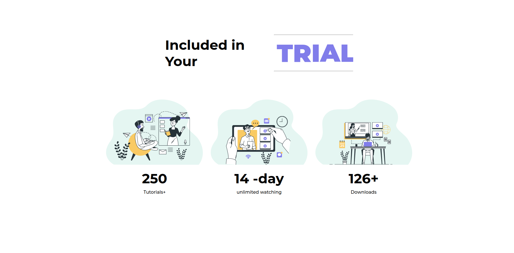
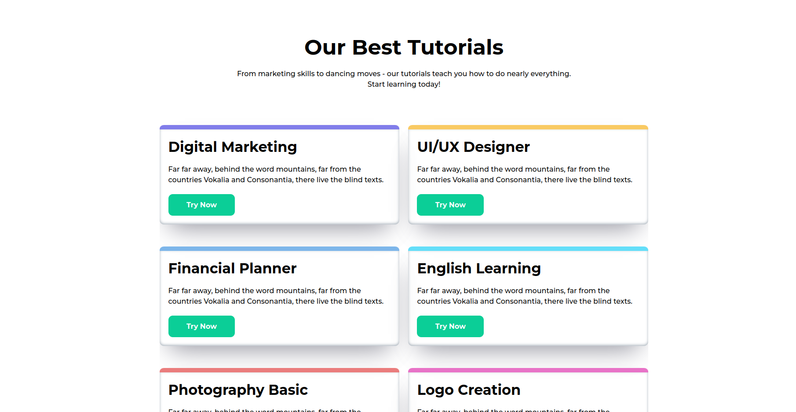

## EdTech Web App

### This application will help students gain access to learning resources:

    Sign Up
    View available course options
    Schedule an appointment with tutors at a particular time
    View application progress status

### This will help Tutors to:

    View their students
    Show their availability for the enrollment
    Track student application status
